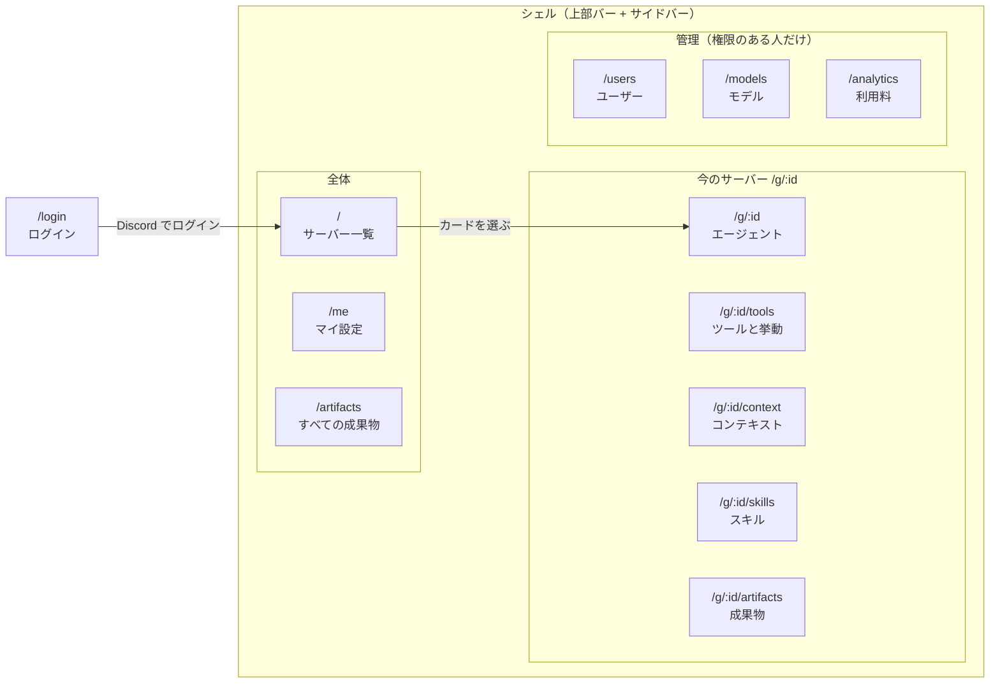
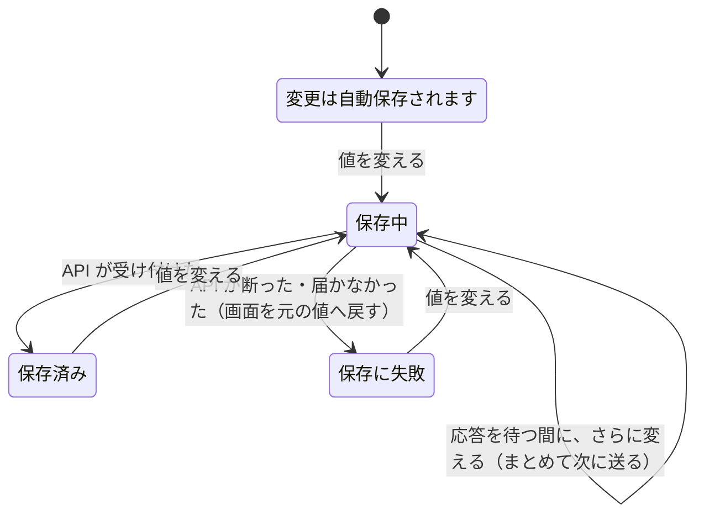

# Web ダッシュボードの構成と見た目

`apps/web` の画面の分け方、保存の見せ方、見た目の決まりをまとめます。判断の経緯は #61 にあります。図はこの文書のために手で描いたもので、実装から生成したものではありません。

## 画面の分け方

上部バーとサイドバー（シェル）の中に、ページが 1 つ入ります。サイドバーは上から「今のサーバー」の 5 ページ、全体、管理の順です。1000px 以下ではサイドバーが引き出しになり、サーバーのページには同じ 5 ページのタブ帯が出ます。



| URL | ページ | 中身 | 開ける人 |
|---|---|---|---|
| `/login` | ログイン | Discord でログイン | 未ログイン |
| `/` | サーバー一覧 | 管理できるサーバーのカード、名前と ID の絞り込み | ログイン済み |
| `/g/:id` | エージェント | 「実際の動作」、`/switch` モデル（モデル・effort・Service Tier）、サブエージェント（モード・共通の設定・役割ごとの設定）、Jev | そのサーバーを管理できる人（API が判定） |
| `/g/:id/tools` | ツールと挙動 | temperature・exa・スレッド履歴、MCP、挙動、トリガーワード | 同上 |
| `/g/:id/context` | コンテキスト | サーバーコンテキスト、persona override | 同上 |
| `/g/:id/skills` | スキル | 一覧、作成、他サーバーからのインポート、有効・無効、削除、ダウンロード | 同上 |
| `/g/:id/artifacts` | 成果物 | このサーバーの公開サイト、延命・永久化・解除 | 同上 |
| `/me` | マイ設定 | 「あなたの上書き」、モデル・サブエージェント・Jev の上書き、ユーザーコンテキスト | ログイン済み |
| `/artifacts` | すべての成果物 | 管理できるサーバー全部の公開サイト | ログイン済み |
| `/users` | ユーザー | ロールの変更 | `can_manage_users` |
| `/models` | モデル | ChatGPT マスターアカウント、プリセットの公開とプレミアム | `can_manage_users` |
| `/analytics` | 利用料 | Anthropic の cost report | `can_view_analytics` |

ページの一覧は `apps/web/src/nav.ts` にあり、サイドバー・タブ帯・コマンドパレットが同じ一覧を使います。

### 「今のサーバー」

サイドバーの 5 ページがどのサーバーを指すかは、URL が `/g/:id` のときはその `id`、それ以外のページでは最後に見ていたサーバーです（ブラウザの `localStorage` の `hibana-guild`。無ければ一覧の先頭）。サイドバーの上のボタンで切り替えます。切り替えると、同じ種類のページのまま別のサーバーへ移ります。

### コマンドパレット

上部バーの「検索・移動」か `Ctrl K`（Mac は `⌘K`）で開きます。サーバー、ページ、今のサーバーの設定項目を 1 つの入力欄から探せます。候補は読み込み済みの一覧から作るので、パレットのための通信はしません。設定項目を選ぶと、そのページへ移って行に目印が付き、部品にフォーカスが移ります。設定項目の一覧は `nav.ts` の `GUILD_SETTINGS` で、行のキー（`data-row`）と対応させています。

### 以前の URL

- `/g/:id#mcp` のような、1 ページだった頃の節へのリンクは、その節があるページへ送ります（`nav.ts` の `LEGACY_SECTION_PAGE`）。`#model` `#agents` `#jev` はエージェントのページに残っています。
- `/skills`（サーバーを選ぶ欄つきのページ）は、今のサーバーの `/g/:id/skills` へ送ります。

## 保存の見せ方

設定行（エージェント・ツールと挙動・コンテキスト・マイ設定）は、変えた時点で保存します。往復を待たずに画面を更新し、失敗したら最後にサーバーが受け付けた値へ戻します（`apps/web/src/settings.tsx` の `useOptimisticPatch`）。コンテキストの文章だけは、明示的な「保存」で送ります。

結果は 2 か所に出ます。成功のトーストは出しません。失敗のときだけ、理由を読めるようにトーストも出します。

- 変えた行の右端の印（保存中・保存済み・保存に失敗）。保存済みの印は 3.2 秒で消えます。
- 上部バーの保存状態。保存済みのときは「bot への反映は最大 30 秒」を添えます。bot は 30 秒ごとに設定を取りに来るためで（[本番環境](production.md)）、届いたかどうかを知る API は無いので、上限だけを案内しています。



サーバーを切り替えると、保存状態は最初に戻ります。前のサーバーへの保存の応答が後から届いても、今のサーバーの画面には反映しません。

数値と URL の欄は、フォーカスを外した時点で保存します。値が変わっていなければ何も送りません。

## 「実際の動作」

エージェントのページの先頭に、保存した値ではなく、設定の組み合わせから決まる値を出します（`apps/web/src/Agent.tsx` の `guildEffective`）。bot の環境変数や接続の状態までは Web から分からないので、見出しの横でそう断っています。

| 条件 | 表示 | 根拠 |
|---|---|---|
| モデルが Anthropic / Auto で、Jev 判定が ON | モデルは「Jev が会話ごとに選ぶ」、effort は「Jev が決める」 | [Anthropic の auto routing](jev.md#anthropic-の-auto-routing) |
| モデルが Anthropic / Auto で、Jev 判定が OFF | `AUTO_ROUTE_FALLBACK` のモデルと effort | 同上（「Jev が使えないとき」） |
| モデルが Anthropic（Auto と固定の 3 モデル） | サブエージェントは off | 同上（「サブエージェントは off です」） |
| サブエージェントが ultra（Anthropic 以外） | effort は xhigh | [Ultracode](ultracode.md) |
| サブエージェントが multi（Anthropic 以外）で、Jev 行動選択モードが ON | Jev 行動選択は「使わない」 | [Jev 判定と行動選択モード](jev.md) |

保存値と違う値で動いている項目は、その設定行にも「いまは使われません。」と理由を出し、部品に斜線の地を敷きます。部品は操作できるままです（保存値は残り、条件が外れると使われるため）。マイ設定では、サーバー側の値が分からないと言い切れないので、この印は出さず、説明文に書き添えるだけにしています。

## 見た目

配色は黒曜石（ダーク）と真珠（ライト）の面に、淡い 5 色の箔（水色・藤・桃・杏・薄緑）です。箔は線・縁・光にだけ使い、塗りは単色にしています（主ボタンはダークで白、ライトで墨。ロゴは色を付けない）。プロバイダの印も文字と同じ色です。

| ファイル（`apps/web/src/styles/`） | 中身 |
|---|---|
| `tokens.css` | 書体、色・寸法のトークン（ライト / ダーク）、基本の要素、動きを減らす設定 |
| `controls.css` | ボタン・入力・セグメント・印・面・ダイアログ・メニュー・トースト・表 |
| `shell.css` | 上部バー・保存状態・サイドバー・ページの枠・コマンドパレット・ログイン |
| `settings.css` | 節・設定行・「実際の動作」・モデル・サブエージェント・トリガー・スキル |
| `pages.css` | サーバー一覧・モデル管理・利用料 |

- **テーマ。** 外観メニューの選択は `localStorage` の `hibana-theme` に保存し、`<html data-theme>` に反映します。「システム」のときは OS の設定に従います。ダークのトークンは `tokens.css` に 2 か所（「ダーク」を選んだとき用と、「システム」で OS がダークのとき用）あり、同じ内容に保ちます。
- **書体。** 欧文と数字は Outfit と Red Hat Mono で、ファイルを同梱しています（出所・ライセンス・生成方法は `apps/web/src/fonts/README.md`）。日本語は端末の書体です。
- **動き。** 場面の変化を説明する動きが 1 回再生されて終わります。値を変えた部品の縁を光が 1 周する、保存できたとき上部バーの下端を光が走る、ページが下から現れる、ナビの現在地の線が滑る、グラフの棒が伸びる、などです。出来事と関係なく続く動きは置いていません（読み込み中のスピナーを除く）。
- **動きを減らす設定。** OS の「動きを減らす」（`prefers-reduced-motion: reduce`）が有効なときは、アニメーションを再生しません。保存の結果は、行の印と上部バーの文字で伝わります。
- **サブエージェントのモード。** 切り替えたときは、選んだカードの縁と薄い色づけが短く現れるだけにしています（まとまり全体を光が回る動きは、#61 の指摘で外しました）。

## 確かめ方

画面テストは `apps/web/tests/` にあります。API は模擬し、fixture の値だけを使います。

```sh
cd apps/web
bun run test:ui                          # 全部
CAPTURE_GALLERY=1 bun run test:ui -g gallery   # 全ページ・全ダイアログの画像を test-results/gallery に書き出す
```

テストが確かめていること: 部品の名前と役割、キーボード操作とフォーカスの戻り先、権限による出し分け、幅 1440 / 768 / 390 / 320 で横スクロールが出ないこと、固定の重なり（パレット・ダイアログ・メニュー）が狭い画面からはみ出さないこと、5 ページの行き来、以前の URL の転送、コマンドパレットの全設定項目が行に届くこと、保存の表示と失敗時の巻き戻し、「実際の動作」の表示、動きを減らす設定、書体が自分のオリジンから配られること。

## この版に入っていないもの

設計のモック（#61 の Artifact）にあって、この版には入れていないものです。必要になったら別の Issue で決めます。

- サーバー一覧の「停止中」「参加していない」の印、会話ログ、利用停止、サーバー単位の停止（未使用の API を使う新しい画面）
- マイ設定の「照らし合わせるサーバー」「上書きだけ表示」「すべてデフォルトに戻す」
- 背景が動き続ける・カーソルに追従する光などの「最大」のエフェクトと、エフェクト量を選ぶ設定
- 利用料の数字のカウントアップ
